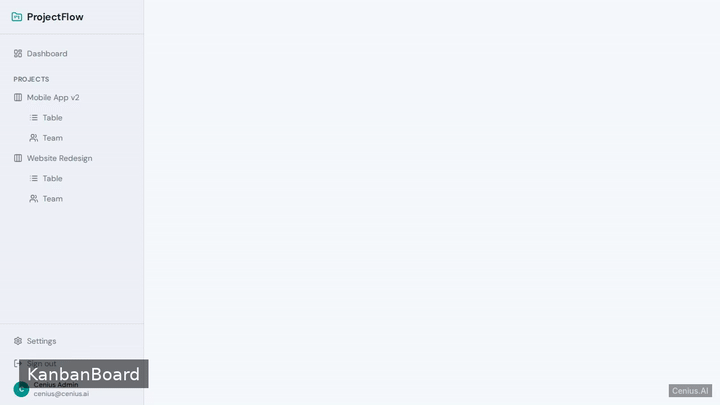
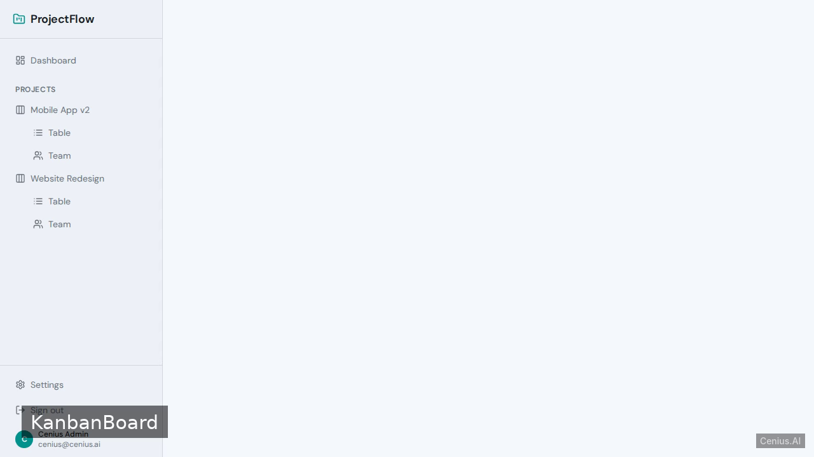
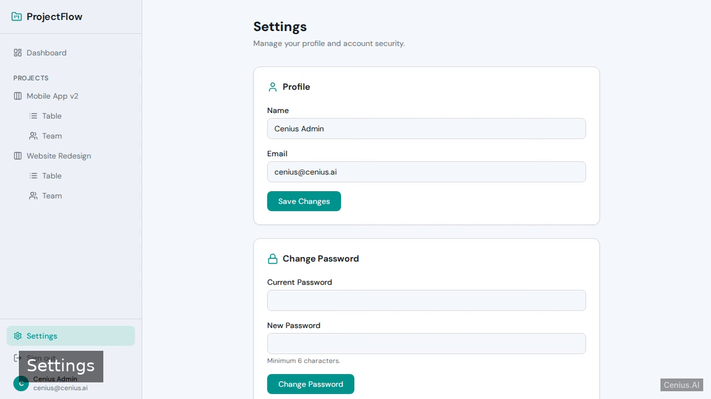

# ProjectFlow — complete Vite kanban board example app

**ProjectFlow** is a production-grade kanban board written in Vite — generated by cenius.ai, Apache-2.0-licensed. A full-stack project-management app with React+Vite frontend and FastAPI backend, featuring JWT authentication with a pre-seeded demo user, a dashboard showing project summaries, a kanban board with drag-and-drop task…. Clone ProjectFlow, run the installer, done — you have a working product in minutes. Want to change something? [Open ProjectFlow on cenius.ai](https://cenius.ai/marketplace/p/projectflow?ref=gh&utm_campaign=projectflow-vite) and say what you need — a revised build ships back, ready to deploy.


[](LICENSE)  [](https://cenius.ai)

[](https://cenius.ai/marketplace/p/projectflow?ref=gh&utm_campaign=projectflow-vite)

> **▶ [Open & edit in cenius.ai](https://cenius.ai/marketplace/p/projectflow?ref=gh&utm_campaign=projectflow-vite)** — one click to an editable workspace: describe changes in plain English, get an instant preview, one-click deploy and host. Modifications made on the platform come with full rebrand & relicense rights.

_Local clone? See [Quick start](#quick-start) below. cenius.ai is the zero-setup path._

## Demo



▶ **[Watch the full demo video](https://cenius.ai/marketplace/p/projectflow?ref=gh&utm_campaign=projectflow-vite)** — the complete walkthrough, playing on the project's cenius.ai page · [MP4 file](.github/media/demo.mp4)

## Screenshots

  

## Quick start

```bash
./install.sh   # installs dependencies + seeds demo data
```

See [`INSTALL.md`](INSTALL.md) for full setup and usage instructions.

## Usage guide

Once the backend and frontend are running, open `http://localhost:5173` in your browser.

### Web Interface

#### Login

The login page (`/login`) displays demo credentials (see `backend/seed.py` for default values). By default the demo user is:

- **Email:** `demo@example.com`
- **Password:** `demo123`

Enter these credentials and click **Sign In**. You will be redirected to the Dashboard.

#### Dashboard

`/dashboard` lists all projects you are a member of, each showing its name, description, and total task count. Click a project to navigate to its kanban board.

#### Kanban Board

URL: `/projects/:projectId/board`

Drag-and-drop tasks between columns: **To Do**, **In Progress**, **Done**. Each card shows the task title and assignee. Click a card to edit details or change status.

#### Tasks Table

URL: `/projects/:projectId/table`

A sortable, filterable table of all tasks in the project. Use the search box to filter by title, the status dropdown to filter by status, and click column headers to sort by title, status, or creation date.

#### Team

URL: `/projects/:projectId/team`

Displays the list of project members with their name, email, role, and join date.

#### Settings

URL: `/settings`

Update your profile name, email, or change your password. The password change requires your current password.

### REST API (for developers or automation)

The backend runs on `http://localhost:8000`. All endpoints (except `/api/health`) require authentication. After logging in, include the `access_token` cookie in subsequent requests.

_Full guide: [`USAGE.md`](USAGE.md)_

## Features

- User Authentication
- Dashboard
- Kanban Board with Drag-and-Drop
- Tasks Table with Sorting and Search
- Team Page
- User Settings

## Architecture

Open the repo and you'll find a complete Vite application (63 files). Top-level layout: `backend/`, `frontend/`. `install.sh` takes care of packages and initial data in a single pass; nothing else is required before launching. Installation walkthrough: [`INSTALL.md`](INSTALL.md).

## FAQ

### What does it take to self-host ProjectFlow?

`git clone` + `./install.sh` gets you a running instance — the install script provisions dependencies and demo data. Full steps live in [`INSTALL.md`](INSTALL.md); nothing external is needed to try it.

### Does the ProjectFlow license allow commercial use?

It is. Apache-2.0 licensing means you can build a product on it, sell it, or use it inside a company with no fees. Details: [LICENSE](LICENSE).

### Can non-developers customise ProjectFlow?

The easiest route: [visit the project on cenius.ai](https://cenius.ai/marketplace/p/projectflow?ref=gh&utm_campaign=projectflow-vite), tell the platform what to change, and collect the updated build. No source-editing needed.

### What is ProjectFlow built with?

ProjectFlow runs on Vite. This repo holds the full production source: you can inspect every part of it before deploying. Highlights include team Page.

### How do I make ProjectFlow my own brand?

Yes. The MIT license lets you remove the original branding and ship under your own name. For a guided approach, [remix it on cenius.ai](https://cenius.ai/marketplace/p/projectflow?ref=gh&utm_campaign=projectflow-vite): you get a fresh build with full rebrand and relicense rights.

## License & rebranding

Released under the [Apache License 2.0](LICENSE) (© 2026 Cenius AI) — free for personal and commercial use. The Cenius name/logo are trademarks (see NOTICE).

**Need a customized version?** [Remix this app on cenius.ai](https://cenius.ai/marketplace/p/projectflow?ref=gh&utm_campaign=projectflow-vite) — modifications made on the platform come with **full rebrand & relicense rights** over your derivative.

## Built with cenius.ai

This entire application — code, design, seeded demo data — was generated on **[cenius.ai](https://cenius.ai)** from a plain-English description.

- 🚀 [Build your own app on cenius.ai](https://cenius.ai)
- 🎛️ [Remix ProjectFlow on the marketplace](https://cenius.ai/marketplace/p/projectflow?ref=gh&utm_campaign=projectflow-vite) — open it in a workspace, prompt for changes, and ship your own version.

More open-source apps: [the Cenius-ai catalog](https://github.com/Cenius-ai) · [showcase index](https://github.com/Cenius-ai/showcase)
